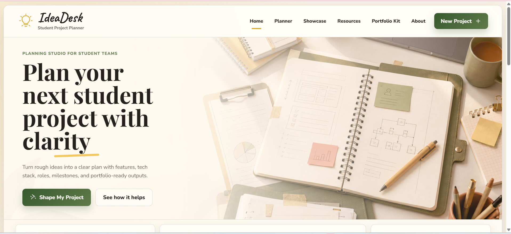

# IdeaDesk — Student Project Planner

IdeaDesk is a responsive student project planning platform that helps students turn rough project ideas into organized, portfolio-ready development plans.

The project was built to apply:
- frontend development fundamentals using HTML, CSS, and JavaScript
- backend and LLM application fundamentals using FastAPI, LangChain, Groq, and structured JSON responses

---

## Preview



---

## Live Demo

Frontend:  
https://amlrizk03.github.io/ideadesk/

Note:  
The frontend is hosted using GitHub Pages.  
The FastAPI backend currently runs locally for AI generation.

---

## Features

- Responsive frontend built with HTML, CSS, and vanilla JavaScript
- Navigation menu and multiple responsive sections
- Functional project planning form
- Project type and timeline selectors
- AI-assisted project plan generation
- Structured project planning cards
- Suggested tech stack and team roles
- Milestone generation
- Portfolio kit section
- README and presentation helper tools

---

## Tech Stack

### Frontend

- HTML
- CSS
- JavaScript

### Backend


- Python
- FastAPI
- LangChain
- Groq

---

## Project Structure

```text
ideadesk/
├── frontend/
│   ├── index.html
│   ├── style.css
│   ├── script.js
│   └── assets/
├── backend/
│   ├── main.py
│   ├── llm_service.py
│   ├── schemas.py
│   ├── requirements.txt
│   ├── .env.example
│   └── README.md
└── README.md